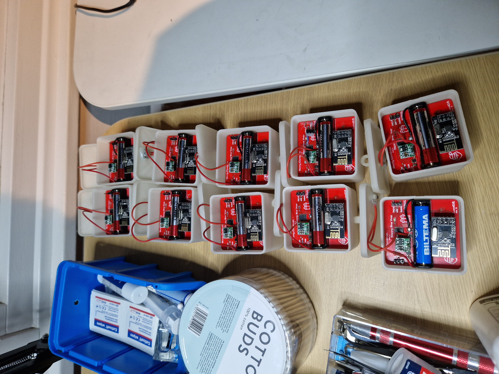
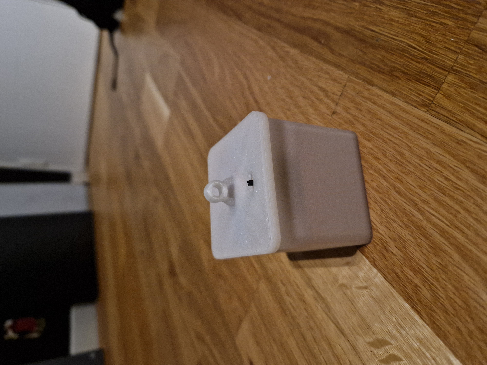

# Lumigift

Lumigift is designed to be an awesome-looking illuminated christmas gift packet! The project consists of:
1. A PCB that contains:
   1. A microcontroller (STM32C0)
   2. 4 RGB LEDs (ws2812)
   3. A radio module (nrf24L01)
   4. Battery holder for a single AAA (1.5) battery
   5. Some other components to make it all work
2. Firmware for the microcontroller on the PCB, written with Arduino
3. A 3D printed box that the PCB fits into, designed in Fusion360
4. Software running on a PC to control the LED colors, written in Python. Note that this library uses a [Crazyradio PA](https://www.bitcraze.io/products/crazyradio-pa/) USB module and the [CrazyRadio](https://github.com/bitcraze/crazyflie-lib-python/blob/master/cflib/drivers/crazyradio.py) driver to control it from Python.
6. A simple webapp that can be used to configure the lumigifts.

## Addressing
The PC controls the color of the LEDs through the Crazyradio PA which communicates with the NRF24L01 modules on the PCB. All lumigifts listens to the same address and dynamick payload is used, without any acks. This way, the PC acts as master and all lumigifts receives the same packages. This way, we can control the LEDs of all lumigifts easily. There is also support for controlling lumigifts individually, by assigning them unique IDs. This way, you can create cool light shows!

## Design

The PCB fits nicely in the 3D printed and the lid snaps on tight enough to keep it on.

